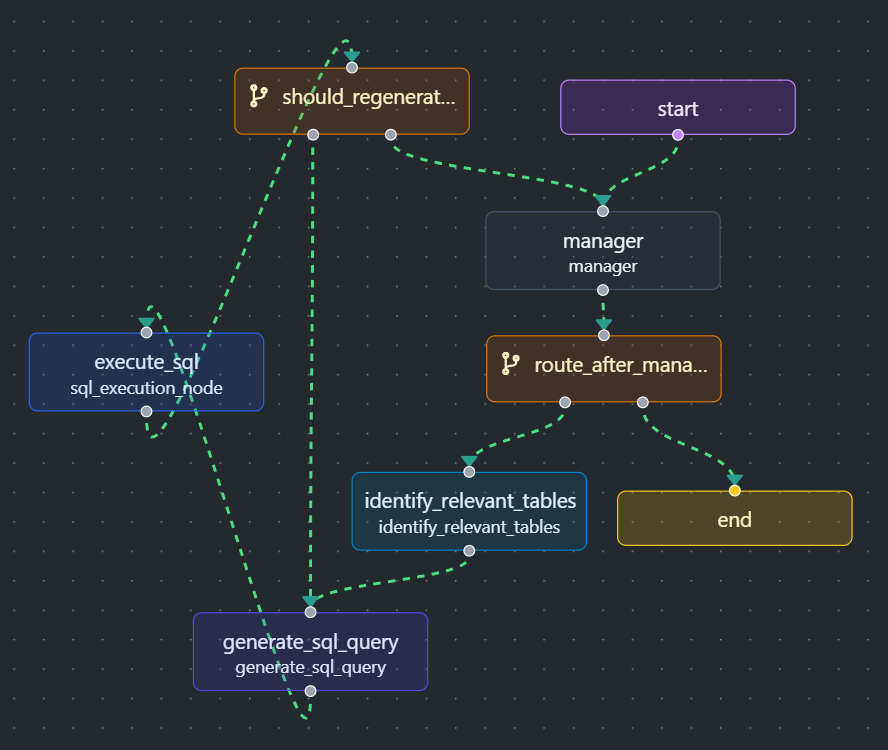

# SQL Agency

The approach is designed to optimize token usage by avoiding lengthy prompts for the entire database schema, which can be costly. Instead, the LLM focuses only on the relevant portion of the schema that pertains to the user's query. For example, if a user inquires about their grades in a specific course, the LLM retrieves and processes the schema for tables such as courses, users, and any related tables, rather than the full database schema. This targeted approach ensures efficiency and relevance while minimizing computational overhead.

- *Using Qwen2.5 7 Billion parameters locally by Ollama.*
- *Provided REST API with FastAPI.*

## Workflow

The process begins with the manager agent, which determines whether the user's input is a general query, such as a greeting, or a database-related question. This is achieved using an LLM with a pydantic structured output containing two optional fields: **instruction** and **response**.

- If the user's input is a general query, the LLM populates only the **response** field, and the router bypasses the agency workflow.
- If the user's input requires querying the database, the LLM translates the user's question from Arabic to English, providing a concise and clear instruction in the **instruction** field. The router then directs the workflow to the SQL agency for further processing.

---

The first step in the agency workflow is to identify the relevant schema to provide to the LLM for SQL query generation. This is achieved using an LLM with a pydantic structured output that returns a list of strings representing the relevant tables to the manager's instructions.

- The LLM determines the relevant tables by analyzing the user's question alongside a hash map, where the keys are table names and the values are their respective column names.
- Once the relevant tables are identified, a get schema tool is invoked. This tool takes the list of relevant tables and generates a detailed schema for each table, including table names, column names, data types, foreign keys, constraints, and a sample of the first three rows from each table. the generated schema is then stored in the **schema** key within the state for subsequent processing.

---

The SQL generator leverages an LLM with a pydantic structured output to produce an SQL query based on the manager's instructions and the provided schema information. The generated SQL query is stored in the **last_query** key within the state. Subsequently, the SQL execution tool is invoked to run the query, and the results are captured as a tool message in the **messages** key within the state.

---

If the execution tool fails due to an incorrect SQL query, the system is equipped with a retry mechanism that allows up to three attempts. Upon failure, the execution tool captures the error message provided by the database provider and stores it in the **error** key within the state. The router then redirects the workflow back to the SQL generator agent.

- The SQL generator agent is re-prompted with the schema, the last failed query, and the captured error message all from the state. Using this information, it regenerates the SQL query and invokes the execution tool again.
- If the execution tool fails after three retries, the router terminates the process to prevent infinite loops.

---

Upon successful execution of the SQL query, the router directs the manager agent to generate a natural language response in Arabic, translating the SQL results into a user-friendly answer to the user's question, In cases where the SQL agency fails and exhausts all retry attempts, the manager agent responds politely, explaining its inability to process the query. If possible, the response includes the reasons for the failure to provide clarity to the user if possible.
